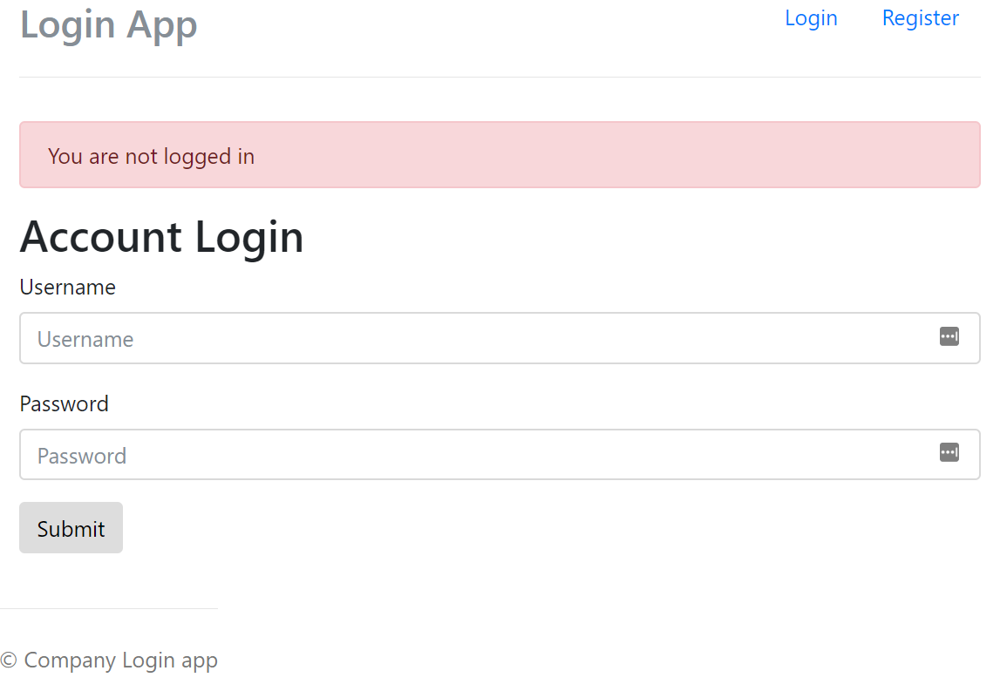

# Login page

> A nodejs application with an Login authentifikation.

## Installation & Usage

1. Clone or download the repository
2. Run `npm install`
3. Run `node app.js`
4. Open the Browser at `localhost:3000`

## Contributing

1. Fork it!
2. Create your feature branch: `git checkout -b my-new-feature`
3. Commit your changes: `git commit -am 'Add some feature'`
4. Push to the branch: `git push origin my-new-feature`
5. Submit a pull request :D